# Sequence Diagrams — Hệ thống quản lý rạp chiếu phim

>
> **Baseline:** 01 System · 02 Actor nghiệp vụ (`Customer`, `Admin`) · 15 Use Case.
>
> **Kiến trúc Sequence Diagram:**
>
> ```text
> Actor
>   ↓
> Frontend
>   ↓
> Controller
>   ↓
> Service
>   ↓
> Repository
>   ↓
> Database
> ```


---

# 1. Quy ước chung

## Kiến trúc Sequence Diagram

Các sequence diagram dùng mức trừu tượng vừa đủ để mô tả luồng nghiệp vụ và kiến trúc xử lý:

```text
Actor
  ↓
Frontend
  ↓
Controller
  ↓
Service
  ↓
Repository
  ↓
Database
```

Các thành phần dùng khi cần:

- **Frontend**: giao diện tương tác với Actor.
- **Controller**: tiếp nhận request và trả response.
- **Service**: xử lý nghiệp vụ.
- **Repository**: truy vấn/cập nhật dữ liệu.
- **Database**: lưu trữ dữ liệu.
- **PaymentGateway**: cổng thanh toán bên ngoài cho thanh toán trực tuyến.
- **BackgroundJob**: tác vụ nội bộ xử lý Hold hết hạn; không phải Actor và không phải Use Case.

## Quy ước UML

- Mỗi UC chỉ mô tả **user goal** tương ứng trong `USECASE.md`.
- Không tách các bước nội bộ như chọn ghế, tính tiền, tạo Ticket, sinh `ticketCode` thành UC riêng.
- Không thêm Employee/SystemScheduler thành Actor.
- Không dùng QR Code.
- `Ticket` không có trạng thái; `ticketCode` là mã định danh để tra cứu.
- `Booking.status` được quản lý; các trạng thái chính gồm `PENDING`, `PAID`, `CANCELLED`, `EXPIRED`.
- `ShowtimeSeat.status` gồm `AVAILABLE`, `HOLD`, `SOLD`.
- Chỉ dùng `alt`, `opt`, `loop` khi có ý nghĩa nghiệp vụ.
- Các thao tác `INSERT`, `UPDATE`, `SELECT` trong diagram chỉ mang tính minh họa tầng Repository/Database, không phải đặc tả API bắt buộc.

---

# 2. Customer

## CUS-01 — Đăng ký tài khoản

### Flow

`Nhập thông tin → Kiểm tra dữ liệu/tính duy nhất → Tạo tài khoản → Thông báo kết quả`

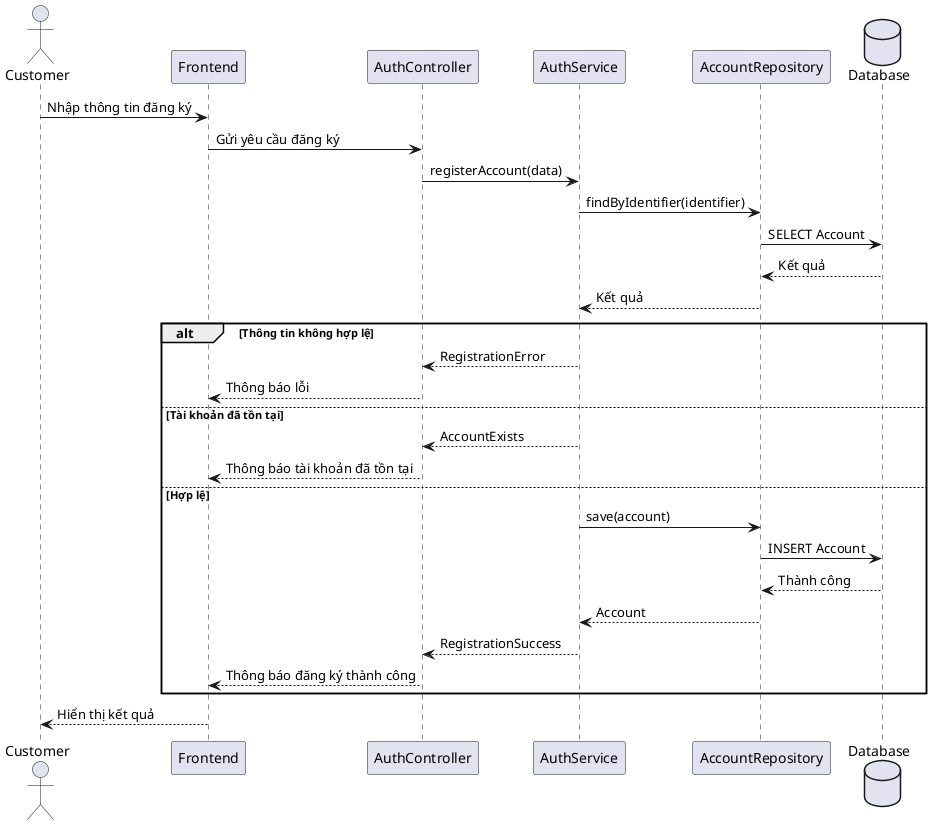
```plantuml
@startuml
actor Customer
participant Frontend
participant "AuthController" as Controller
participant "AuthService" as Service
participant "AccountRepository" as Repo
database Database as DB

Customer -> Frontend : Nhập thông tin đăng ký
Frontend -> Controller : Gửi yêu cầu đăng ký
Controller -> Service : registerAccount(data)
Service -> Repo : findByIdentifier(identifier)
Repo -> DB : SELECT Account
DB --> Repo : Kết quả
Repo --> Service : Kết quả

alt Thông tin không hợp lệ
    Service --> Controller : RegistrationError
    Controller --> Frontend : Thông báo lỗi
else Tài khoản đã tồn tại
    Service --> Controller : AccountExists
    Controller --> Frontend : Thông báo tài khoản đã tồn tại
else Hợp lệ
    Service -> Repo : save(account)
    Repo -> DB : INSERT Account
    DB --> Repo : Thành công
    Repo --> Service : Account
    Service --> Controller : RegistrationSuccess
    Controller --> Frontend : Thông báo đăng ký thành công
end

Frontend --> Customer : Hiển thị kết quả
@enduml
```

### Giải thích từng bước

1. Customer nhập thông tin đăng ký trên Frontend.
2. `AuthController` chuyển dữ liệu cho `AuthService`.
3. Service kiểm tra dữ liệu và tính duy nhất thông qua `AccountRepository`.
4. Nếu dữ liệu không hợp lệ hoặc tài khoản đã tồn tại, hệ thống trả lỗi.
5. Nếu hợp lệ, Service yêu cầu Repository tạo tài khoản Customer.
6. Database lưu tài khoản và Frontend hiển thị kết quả.

---

## CUS-02 — Đăng nhập

### Flow

`Nhập thông tin → Xác thực → Kiểm tra trạng thái tài khoản → Tạo phiên → Điều hướng theo vai trò`

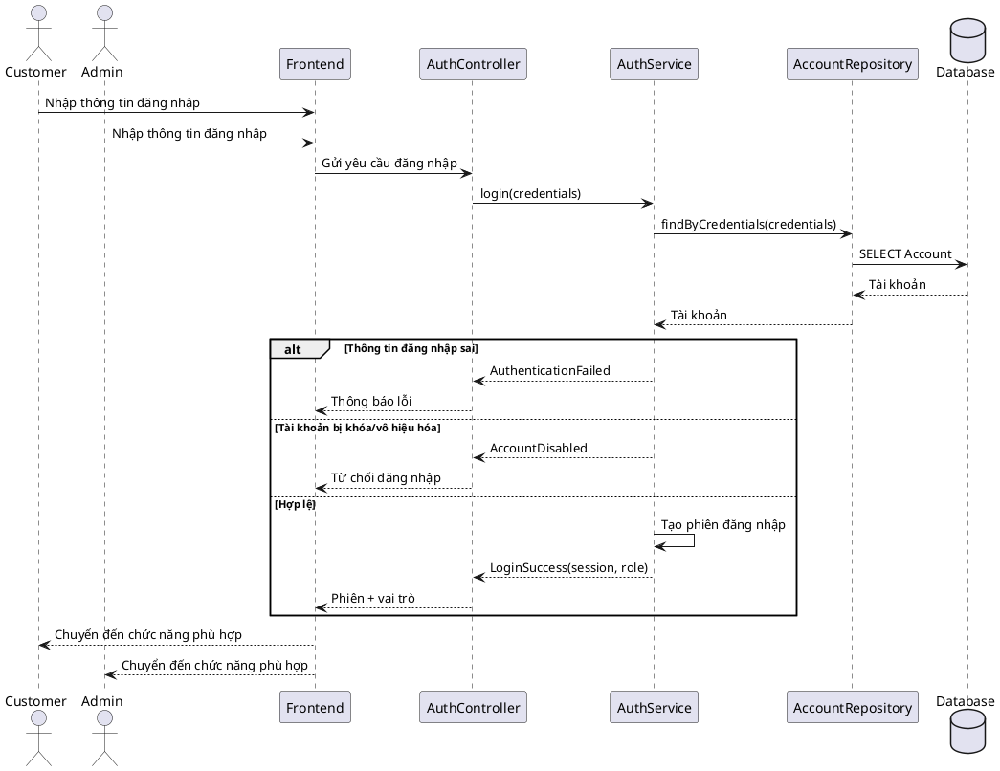
```plantuml
@startuml
actor Customer
actor Admin
participant Frontend
participant "AuthController" as Controller
participant "AuthService" as Service
participant "AccountRepository" as Repo
database Database as DB

Customer -> Frontend : Nhập thông tin đăng nhập
Admin -> Frontend : Nhập thông tin đăng nhập
Frontend -> Controller : Gửi yêu cầu đăng nhập
Controller -> Service : login(credentials)
Service -> Repo : findByCredentials(credentials)
Repo -> DB : SELECT Account
DB --> Repo : Tài khoản
Repo --> Service : Tài khoản

alt Thông tin đăng nhập sai
    Service --> Controller : AuthenticationFailed
    Controller --> Frontend : Thông báo lỗi
else Tài khoản bị khóa/vô hiệu hóa
    Service --> Controller : AccountDisabled
    Controller --> Frontend : Từ chối đăng nhập
else Hợp lệ
    Service -> Service : Tạo phiên đăng nhập
    Service --> Controller : LoginSuccess(session, role)
    Controller --> Frontend : Phiên + vai trò
end

Frontend --> Customer : Chuyển đến chức năng phù hợp
Frontend --> Admin : Chuyển đến chức năng phù hợp
@enduml
```

### Giải thích từng bước

1. Customer hoặc Admin nhập thông tin đăng nhập.
2. `AuthService` xác thực tài khoản thông qua `AccountRepository`.
3. Hệ thống kiểm tra trạng thái tài khoản.
4. Nếu tài khoản bị khóa/vô hiệu hóa hoặc thông tin sai, đăng nhập bị từ chối.
5. Nếu hợp lệ, Service tạo phiên và trả về vai trò.
6. Frontend điều hướng người dùng đến các chức năng phù hợp.

---

## CUS-03 — Quản lý thông tin cá nhân

### Flow

`Mở thông tin cá nhân → Lấy thông tin → Hiển thị → Cập nhật tùy chọn → Kiểm tra → Lưu`

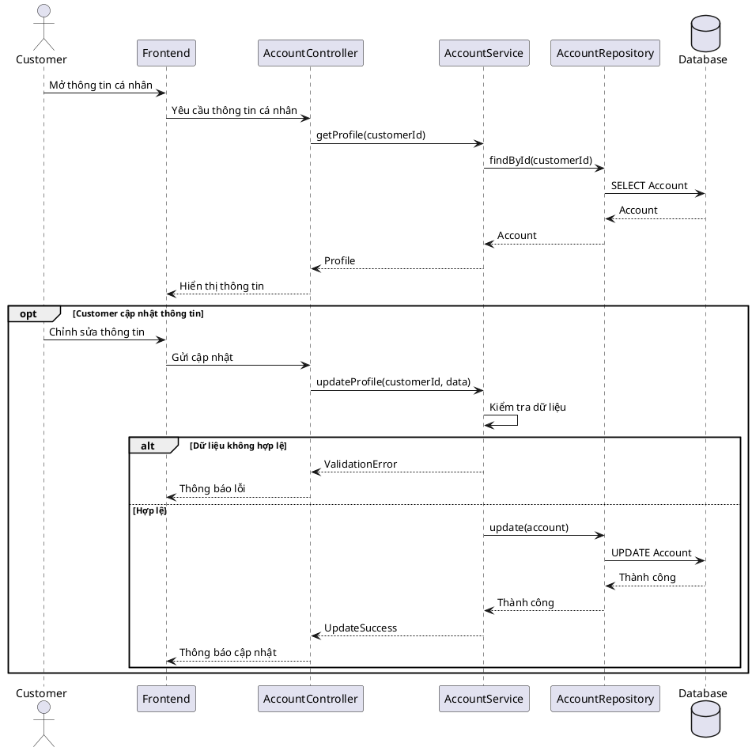
```plantuml
@startuml
actor Customer
participant Frontend
participant "AccountController" as Controller
participant "AccountService" as Service
participant "AccountRepository" as Repo
database Database as DB

Customer -> Frontend : Mở thông tin cá nhân
Frontend -> Controller : Yêu cầu thông tin cá nhân
Controller -> Service : getProfile(customerId)
Service -> Repo : findById(customerId)
Repo -> DB : SELECT Account
DB --> Repo : Account
Repo --> Service : Account
Service --> Controller : Profile
Controller --> Frontend : Hiển thị thông tin

opt Customer cập nhật thông tin
    Customer -> Frontend : Chỉnh sửa thông tin
    Frontend -> Controller : Gửi cập nhật
    Controller -> Service : updateProfile(customerId, data)
    Service -> Service : Kiểm tra dữ liệu
    alt Dữ liệu không hợp lệ
        Service --> Controller : ValidationError
        Controller --> Frontend : Thông báo lỗi
    else Hợp lệ
        Service -> Repo : update(account)
        Repo -> DB : UPDATE Account
        DB --> Repo : Thành công
        Repo --> Service : Thành công
        Service --> Controller : UpdateSuccess
        Controller --> Frontend : Thông báo cập nhật
    end
end
@enduml
```

### Giải thích từng bước

1. Customer mở trang thông tin cá nhân.
2. Service lấy tài khoản hiện tại qua Repository.
3. Frontend hiển thị thông tin.
4. Nếu Customer chọn cập nhật, Service kiểm tra dữ liệu.
5. Dữ liệu hợp lệ được Repository lưu vào Database.
6. Hệ thống thông báo kết quả.

---

## CUS-04 — Xem phim và suất chiếu

### Flow

`Xem danh sách phim → Tìm kiếm/lọc → Chọn phim → Xem suất chiếu → Chọn suất chiếu`

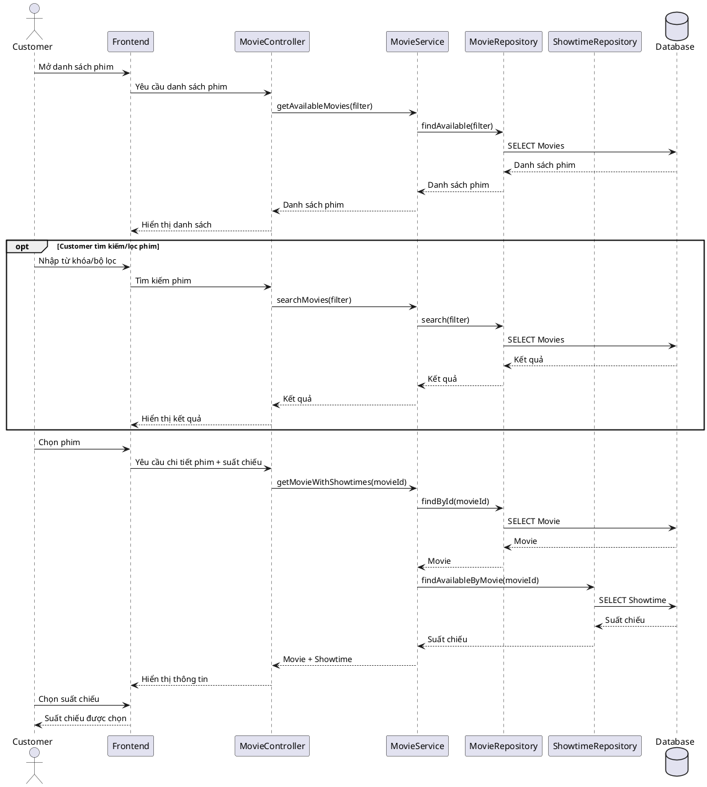
```plantuml
@startuml
actor Customer
participant Frontend
participant "MovieController" as MovieController
participant "MovieService" as MovieService
participant "MovieRepository" as MovieRepo
participant "ShowtimeRepository" as ShowtimeRepo
database Database as DB

Customer -> Frontend : Mở danh sách phim
Frontend -> MovieController : Yêu cầu danh sách phim
MovieController -> MovieService : getAvailableMovies(filter)
MovieService -> MovieRepo : findAvailable(filter)
MovieRepo -> DB : SELECT Movies
DB --> MovieRepo : Danh sách phim
MovieRepo --> MovieService : Danh sách phim
MovieService --> MovieController : Danh sách phim
MovieController --> Frontend : Hiển thị danh sách

opt Customer tìm kiếm/lọc phim
    Customer -> Frontend : Nhập từ khóa/bộ lọc
    Frontend -> MovieController : Tìm kiếm phim
    MovieController -> MovieService : searchMovies(filter)
    MovieService -> MovieRepo : search(filter)
    MovieRepo -> DB : SELECT Movies
    DB --> MovieRepo : Kết quả
    MovieRepo --> MovieService : Kết quả
    MovieService --> MovieController : Kết quả
    MovieController --> Frontend : Hiển thị kết quả
end

Customer -> Frontend : Chọn phim
Frontend -> MovieController : Yêu cầu chi tiết phim + suất chiếu
MovieController -> MovieService : getMovieWithShowtimes(movieId)
MovieService -> MovieRepo : findById(movieId)
MovieRepo -> DB : SELECT Movie
DB --> MovieRepo : Movie
MovieRepo --> MovieService : Movie
MovieService -> ShowtimeRepo : findAvailableByMovie(movieId)
ShowtimeRepo -> DB : SELECT Showtime
DB --> ShowtimeRepo : Suất chiếu
ShowtimeRepo --> MovieService : Suất chiếu
MovieService --> MovieController : Movie + Showtime
MovieController --> Frontend : Hiển thị thông tin

Customer -> Frontend : Chọn suất chiếu
Frontend --> Customer : Suất chiếu được chọn
@enduml
```

### Giải thích từng bước

1. Customer mở danh sách phim.
2. Movie Service lấy các phim đang hiển thị.
3. Customer có thể tìm kiếm/lọc phim.
4. Khi chọn một phim, hệ thống lấy thông tin phim và các suất chiếu đang mở bán.
5. Customer chọn một suất chiếu để tiếp tục đặt vé.

---

## CUS-05 — Đặt vé online

### Flow

`Chọn suất chiếu → Xem ghế → Chọn ghế → HOLD + tạo Booking PENDING → Chọn Bắp Nước tùy chọn → Tính tiền → Thanh toán → PAID → SOLD → Tạo Ticket + ticketCode`

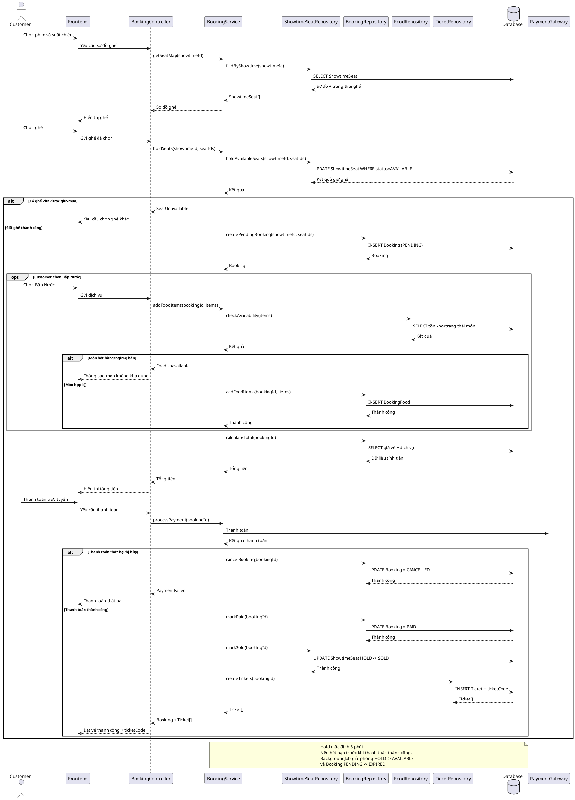
```plantuml
@startuml
actor Customer
participant Frontend
participant "BookingController" as BookingController
participant "BookingService" as BookingService
participant "ShowtimeSeatRepository" as SeatRepo
participant "BookingRepository" as BookingRepo
participant "FoodRepository" as FoodRepo
participant "TicketRepository" as TicketRepo
database Database as DB
participant PaymentGateway

Customer -> Frontend : Chọn phim và suất chiếu
Frontend -> BookingController : Yêu cầu sơ đồ ghế
BookingController -> BookingService : getSeatMap(showtimeId)
BookingService -> SeatRepo : findByShowtime(showtimeId)
SeatRepo -> DB : SELECT ShowtimeSeat
DB --> SeatRepo : Sơ đồ + trạng thái ghế
SeatRepo --> BookingService : ShowtimeSeat[]
BookingService --> BookingController : Sơ đồ ghế
BookingController --> Frontend : Hiển thị ghế

Customer -> Frontend : Chọn ghế
Frontend -> BookingController : Gửi ghế đã chọn
BookingController -> BookingService : holdSeats(showtimeId, seatIds)
BookingService -> SeatRepo : holdAvailableSeats(showtimeId, seatIds)
SeatRepo -> DB : UPDATE ShowtimeSeat WHERE status=AVAILABLE
DB --> SeatRepo : Kết quả giữ ghế
SeatRepo --> BookingService : Kết quả

alt Có ghế vừa được giữ/mua
    BookingService --> BookingController : SeatUnavailable
    BookingController --> Frontend : Yêu cầu chọn ghế khác
else Giữ ghế thành công
    BookingService -> BookingRepo : createPendingBooking(showtimeId, seatIds)
    BookingRepo -> DB : INSERT Booking (PENDING)
    DB --> BookingRepo : Booking
    BookingRepo --> BookingService : Booking

    opt Customer chọn Bắp Nước
        Customer -> Frontend : Chọn Bắp Nước
        Frontend -> BookingController : Gửi dịch vụ
        BookingController -> BookingService : addFoodItems(bookingId, items)
        BookingService -> FoodRepo : checkAvailability(items)
        FoodRepo -> DB : SELECT tồn kho/trạng thái món
        DB --> FoodRepo : Kết quả
        FoodRepo --> BookingService : Kết quả
        alt Món hết hàng/ngừng bán
            BookingService --> BookingController : FoodUnavailable
            BookingController --> Frontend : Thông báo món không khả dụng
        else Món hợp lệ
            BookingService -> BookingRepo : addFoodItems(bookingId, items)
            BookingRepo -> DB : INSERT BookingFood
            DB --> BookingRepo : Thành công
            BookingRepo --> BookingService : Thành công
        end
    end

    BookingService -> BookingRepo : calculateTotal(bookingId)
    BookingRepo -> DB : SELECT giá vé + dịch vụ
    DB --> BookingRepo : Dữ liệu tính tiền
    BookingRepo --> BookingService : Tổng tiền
    BookingService --> BookingController : Tổng tiền
    BookingController --> Frontend : Hiển thị tổng tiền

    Customer -> Frontend : Thanh toán trực tuyến
    Frontend -> BookingController : Yêu cầu thanh toán
    BookingController -> BookingService : processPayment(bookingId)
    BookingService -> PaymentGateway : Thanh toán
    PaymentGateway --> BookingService : Kết quả thanh toán

    alt Thanh toán thất bại/bị hủy
        BookingService -> BookingRepo : cancelBooking(bookingId)
        BookingRepo -> DB : UPDATE Booking = CANCELLED
        DB --> BookingRepo : Thành công
        BookingService --> BookingController : PaymentFailed
        BookingController --> Frontend : Thanh toán thất bại
    else Thanh toán thành công
        BookingService -> BookingRepo : markPaid(bookingId)
        BookingRepo -> DB : UPDATE Booking = PAID
        DB --> BookingRepo : Thành công
        BookingService -> SeatRepo : markSold(bookingId)
        SeatRepo -> DB : UPDATE ShowtimeSeat HOLD -> SOLD
        DB --> SeatRepo : Thành công
        BookingService -> TicketRepo : createTickets(bookingId)
        TicketRepo -> DB : INSERT Ticket + ticketCode
        DB --> TicketRepo : Ticket[]
        TicketRepo --> BookingService : Ticket[]
        BookingService --> BookingController : Booking + Ticket[]
        BookingController --> Frontend : Đặt vé thành công + ticketCode
    end
end

note over BookingService, DB
Hold mặc định 5 phút.
Nếu hết hạn trước khi thanh toán thành công,
BackgroundJob giải phóng HOLD -> AVAILABLE
và Booking PENDING -> EXPIRED.
end note
@enduml
```

### Giải thích từng bước

1. Customer chọn phim và suất chiếu, sau đó yêu cầu sơ đồ ghế.
2. Hệ thống lấy `ShowtimeSeat` và hiển thị trạng thái ghế.
3. Customer chọn ghế. Service yêu cầu Repository giữ ghế theo điều kiện `AVAILABLE` để tránh hai khách cùng giữ một ghế.
4. Nếu giữ thành công, hệ thống tạo `Booking` ở trạng thái `PENDING` và bắt đầu thời hạn Hold 5 phút.
5. Customer có thể chọn Bắp Nước; hệ thống kiểm tra trạng thái bán và tồn kho.
6. Service tính tổng tiền theo giá vé đang áp dụng và dịch vụ đã chọn.
7. Customer thanh toán qua `PaymentGateway`.
8. Nếu thanh toán thất bại/bị hủy, Booking chuyển `CANCELLED`.
9. Nếu thanh toán thành công, Booking chuyển `PAID`, các `ShowtimeSeat` chuyển `SOLD`.
10. Hệ thống tạo Ticket và sinh `ticketCode`.
11. Frontend hiển thị thông tin Booking và `ticketCode`.

### Xử lý Hold hết hạn

- Đây là **xử lý nội bộ**, không phải Actor/Use Case.
- `BackgroundJob` định kỳ tìm các `ShowtimeSeat` đang `HOLD` và đã quá hạn.
- Ghế được chuyển `AVAILABLE`; Booking tương ứng chưa thanh toán được chuyển `EXPIRED`.
- Không thay đổi `SOLD` hoặc `AVAILABLE` ngoài trường hợp xử lý Hold đã hết hạn.

---

## CUS-06 — Quản lý vé điện tử và lịch sử đặt vé

### Flow

`Mở lịch sử → Lấy Booking của Customer → Xem chi tiết → Nếu PAID thì xem Ticket + ticketCode`

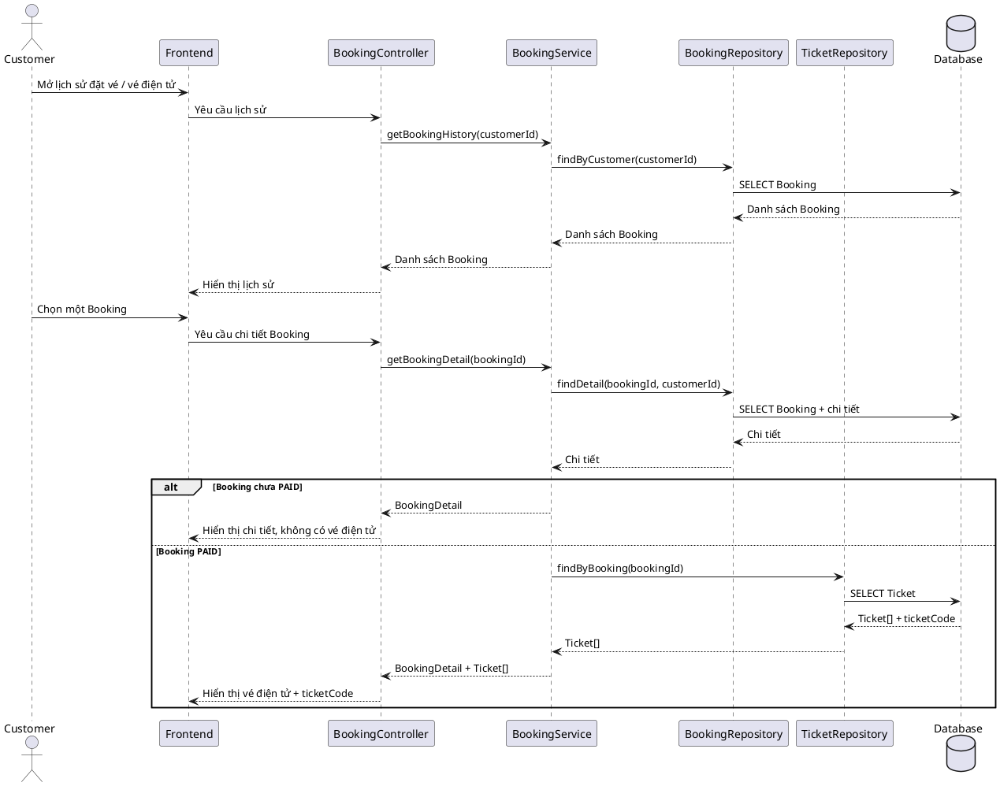
```plantuml
@startuml
actor Customer
participant Frontend
participant "BookingController" as Controller
participant "BookingService" as Service
participant "BookingRepository" as BookingRepo
participant "TicketRepository" as TicketRepo
database Database as DB

Customer -> Frontend : Mở lịch sử đặt vé / vé điện tử
Frontend -> Controller : Yêu cầu lịch sử
Controller -> Service : getBookingHistory(customerId)
Service -> BookingRepo : findByCustomer(customerId)
BookingRepo -> DB : SELECT Booking
DB --> BookingRepo : Danh sách Booking
BookingRepo --> Service : Danh sách Booking
Service --> Controller : Danh sách Booking
Controller --> Frontend : Hiển thị lịch sử

Customer -> Frontend : Chọn một Booking
Frontend -> Controller : Yêu cầu chi tiết Booking
Controller -> Service : getBookingDetail(bookingId)
Service -> BookingRepo : findDetail(bookingId, customerId)
BookingRepo -> DB : SELECT Booking + chi tiết
DB --> BookingRepo : Chi tiết
BookingRepo --> Service : Chi tiết

alt Booking chưa PAID
    Service --> Controller : BookingDetail
    Controller --> Frontend : Hiển thị chi tiết, không có vé điện tử
else Booking PAID
    Service -> TicketRepo : findByBooking(bookingId)
    TicketRepo -> DB : SELECT Ticket
    DB --> TicketRepo : Ticket[] + ticketCode
    TicketRepo --> Service : Ticket[]
    Service --> Controller : BookingDetail + Ticket[]
    Controller --> Frontend : Hiển thị vé điện tử + ticketCode
end
@enduml
```

### Giải thích từng bước

1. Customer mở lịch sử đặt vé.
2. Hệ thống chỉ truy vấn Booking thuộc Customer hiện tại.
3. Customer chọn một Booking để xem chi tiết.
4. Nếu Booking chưa `PAID`, hệ thống chỉ hiển thị thông tin Booking.
5. Nếu Booking `PAID`, hệ thống lấy Ticket và `ticketCode` để hiển thị vé điện tử.
6. UC chỉ đọc dữ liệu, không thay đổi nghiệp vụ.

---

# 3. Admin

> **Tiền điều kiện chung:** Admin đã đăng nhập qua `CUS-02` và có quyền quản trị.

## ADM-01 — Quản lý phim

### Flow

`Xem danh sách → Tìm kiếm/lọc → Thêm/Sửa/Thay đổi trạng thái → Kiểm tra → Lưu`

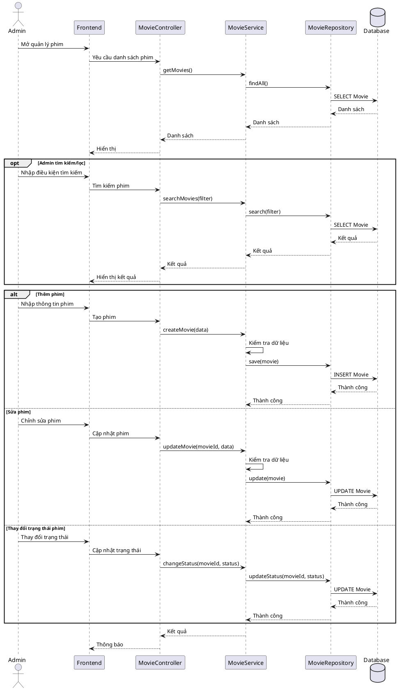
```plantuml
@startuml
actor Admin
participant Frontend
participant "MovieController" as Controller
participant "MovieService" as Service
participant "MovieRepository" as Repo
database Database as DB

Admin -> Frontend : Mở quản lý phim
Frontend -> Controller : Yêu cầu danh sách phim
Controller -> Service : getMovies()
Service -> Repo : findAll()
Repo -> DB : SELECT Movie
DB --> Repo : Danh sách
Repo --> Service : Danh sách
Service --> Controller : Danh sách
Controller --> Frontend : Hiển thị

opt Admin tìm kiếm/lọc
    Admin -> Frontend : Nhập điều kiện tìm kiếm
    Frontend -> Controller : Tìm kiếm phim
    Controller -> Service : searchMovies(filter)
    Service -> Repo : search(filter)
    Repo -> DB : SELECT Movie
    DB --> Repo : Kết quả
    Repo --> Service : Kết quả
    Service --> Controller : Kết quả
    Controller --> Frontend : Hiển thị kết quả
end

alt Thêm phim
    Admin -> Frontend : Nhập thông tin phim
    Frontend -> Controller : Tạo phim
    Controller -> Service : createMovie(data)
    Service -> Service : Kiểm tra dữ liệu
    Service -> Repo : save(movie)
    Repo -> DB : INSERT Movie
    DB --> Repo : Thành công
    Repo --> Service : Thành công
else Sửa phim
    Admin -> Frontend : Chỉnh sửa phim
    Frontend -> Controller : Cập nhật phim
    Controller -> Service : updateMovie(movieId, data)
    Service -> Service : Kiểm tra dữ liệu
    Service -> Repo : update(movie)
    Repo -> DB : UPDATE Movie
    DB --> Repo : Thành công
    Repo --> Service : Thành công
else Thay đổi trạng thái phim
    Admin -> Frontend : Thay đổi trạng thái
    Frontend -> Controller : Cập nhật trạng thái
    Controller -> Service : changeStatus(movieId, status)
    Service -> Repo : updateStatus(movieId, status)
    Repo -> DB : UPDATE Movie
    DB --> Repo : Thành công
    Repo --> Service : Thành công
end

Service --> Controller : Kết quả
Controller --> Frontend : Thông báo
@enduml
```

### Giải thích từng bước

1. Admin xem danh sách phim và có thể tìm kiếm/lọc.
2. Admin chọn thêm, sửa hoặc thay đổi trạng thái phim.
3. Service kiểm tra dữ liệu và xử lý nghiệp vụ.
4. Repository lưu thay đổi vào Database.
5. Phim không hiển thị/ngừng chiếu sẽ không được đưa ra cho Customer.

---

## ADM-02 — Quản lý suất chiếu

### Flow

`Xem danh sách → Tìm kiếm/lọc → Thêm/Sửa/Thay đổi trạng thái → Kiểm tra xung đột → Lưu → Khởi tạo ShowtimeSeat khi tạo mới`

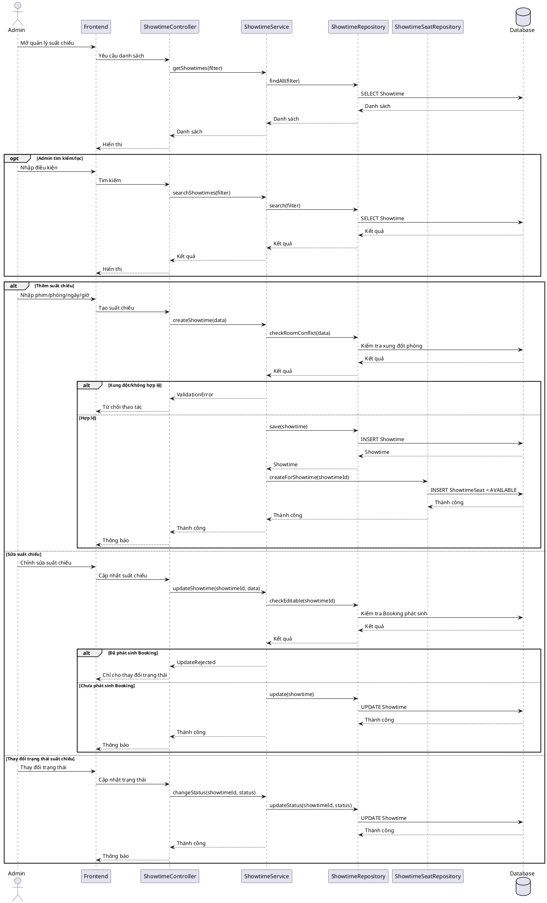
```plantuml
@startuml
actor Admin
participant Frontend
participant "ShowtimeController" as Controller
participant "ShowtimeService" as Service
participant "ShowtimeRepository" as ShowtimeRepo
participant "ShowtimeSeatRepository" as SeatRepo
database Database as DB

Admin -> Frontend : Mở quản lý suất chiếu
Frontend -> Controller : Yêu cầu danh sách
Controller -> Service : getShowtimes(filter)
Service -> ShowtimeRepo : findAll(filter)
ShowtimeRepo -> DB : SELECT Showtime
DB --> ShowtimeRepo : Danh sách
ShowtimeRepo --> Service : Danh sách
Service --> Controller : Danh sách
Controller --> Frontend : Hiển thị

opt Admin tìm kiếm/lọc
    Admin -> Frontend : Nhập điều kiện
    Frontend -> Controller : Tìm kiếm
    Controller -> Service : searchShowtimes(filter)
    Service -> ShowtimeRepo : search(filter)
    ShowtimeRepo -> DB : SELECT Showtime
    DB --> ShowtimeRepo : Kết quả
    ShowtimeRepo --> Service : Kết quả
    Service --> Controller : Kết quả
    Controller --> Frontend : Hiển thị
end

alt Thêm suất chiếu
    Admin -> Frontend : Nhập phim/phòng/ngày/giờ
    Frontend -> Controller : Tạo suất chiếu
    Controller -> Service : createShowtime(data)
    Service -> ShowtimeRepo : checkRoomConflict(data)
    ShowtimeRepo -> DB : Kiểm tra xung đột phòng
    DB --> ShowtimeRepo : Kết quả
    ShowtimeRepo --> Service : Kết quả
    alt Xung đột/không hợp lệ
        Service --> Controller : ValidationError
        Controller --> Frontend : Từ chối thao tác
    else Hợp lệ
        Service -> ShowtimeRepo : save(showtime)
        ShowtimeRepo -> DB : INSERT Showtime
        DB --> ShowtimeRepo : Showtime
        ShowtimeRepo --> Service : Showtime
        Service -> SeatRepo : createForShowtime(showtimeId)
        SeatRepo -> DB : INSERT ShowtimeSeat = AVAILABLE
        DB --> SeatRepo : Thành công
        SeatRepo --> Service : Thành công
        Service --> Controller : Thành công
        Controller --> Frontend : Thông báo
    end
else Sửa suất chiếu
    Admin -> Frontend : Chỉnh sửa suất chiếu
    Frontend -> Controller : Cập nhật suất chiếu
    Controller -> Service : updateShowtime(showtimeId, data)
    Service -> ShowtimeRepo : checkEditable(showtimeId)
    ShowtimeRepo -> DB : Kiểm tra Booking phát sinh
    DB --> ShowtimeRepo : Kết quả
    ShowtimeRepo --> Service : Kết quả
    alt Đã phát sinh Booking
        Service --> Controller : UpdateRejected
        Controller --> Frontend : Chỉ cho thay đổi trạng thái
    else Chưa phát sinh Booking
        Service -> ShowtimeRepo : update(showtime)
        ShowtimeRepo -> DB : UPDATE Showtime
        DB --> ShowtimeRepo : Thành công
        Service --> Controller : Thành công
        Controller --> Frontend : Thông báo
    end
else Thay đổi trạng thái suất chiếu
    Admin -> Frontend : Thay đổi trạng thái
    Frontend -> Controller : Cập nhật trạng thái
    Controller -> Service : changeStatus(showtimeId, status)
    Service -> ShowtimeRepo : updateStatus(showtimeId, status)
    ShowtimeRepo -> DB : UPDATE Showtime
    DB --> ShowtimeRepo : Thành công
    Service --> Controller : Thành công
    Controller --> Frontend : Thông báo
end
@enduml
```

### Giải thích từng bước

1. Admin xem và tìm kiếm suất chiếu.
2. Khi tạo suất chiếu, Service kiểm tra xung đột phòng và dữ liệu đầu vào.
3. Nếu hợp lệ, hệ thống tạo `Showtime` và các `ShowtimeSeat` ở trạng thái `AVAILABLE`.
4. Nếu suất chiếu đã phát sinh Booking, hệ thống không cho sửa phim/phòng/giờ; chỉ cho thay đổi trạng thái.
5. Admin có thể thay đổi trạng thái suất chiếu theo nghiệp vụ.

---

## ADM-03 — Quản lý phòng chiếu và sơ đồ chỗ ngồi

### Flow

`Xem phòng → Tìm kiếm → Quản lý phòng hoặc sơ đồ ghế → Kiểm tra ràng buộc → Lưu`

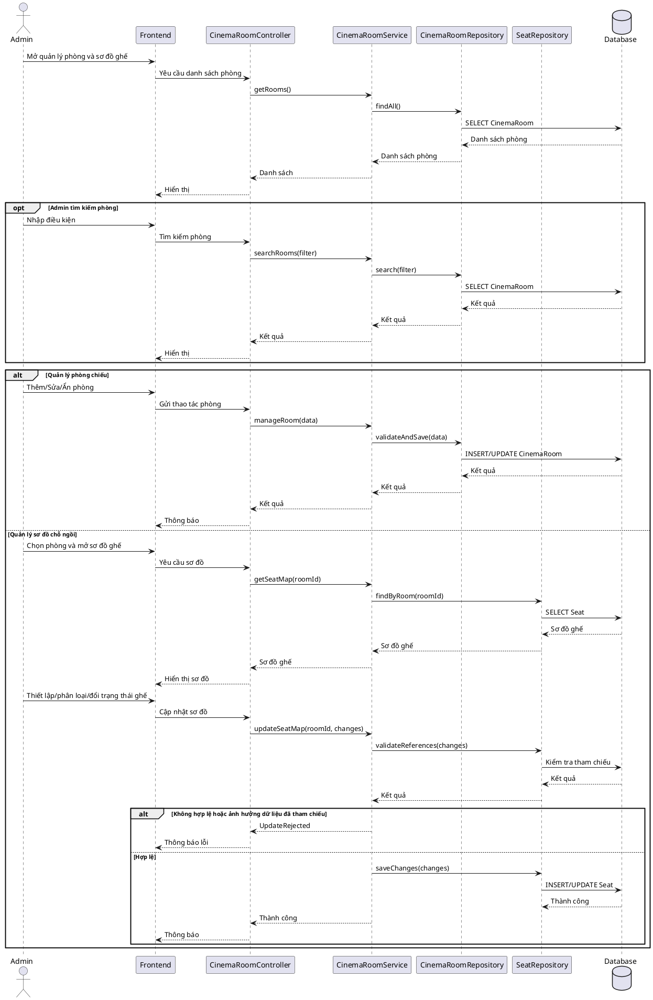
```plantuml
@startuml
actor Admin
participant Frontend
participant "CinemaRoomController" as Controller
participant "CinemaRoomService" as Service
participant "CinemaRoomRepository" as RoomRepo
participant "SeatRepository" as SeatRepo
database Database as DB

Admin -> Frontend : Mở quản lý phòng và sơ đồ ghế
Frontend -> Controller : Yêu cầu danh sách phòng
Controller -> Service : getRooms()
Service -> RoomRepo : findAll()
RoomRepo -> DB : SELECT CinemaRoom
DB --> RoomRepo : Danh sách phòng
RoomRepo --> Service : Danh sách phòng
Service --> Controller : Danh sách
Controller --> Frontend : Hiển thị

opt Admin tìm kiếm phòng
    Admin -> Frontend : Nhập điều kiện
    Frontend -> Controller : Tìm kiếm phòng
    Controller -> Service : searchRooms(filter)
    Service -> RoomRepo : search(filter)
    RoomRepo -> DB : SELECT CinemaRoom
    DB --> RoomRepo : Kết quả
    RoomRepo --> Service : Kết quả
    Service --> Controller : Kết quả
    Controller --> Frontend : Hiển thị
end

alt Quản lý phòng chiếu
    Admin -> Frontend : Thêm/Sửa/Ẩn phòng
    Frontend -> Controller : Gửi thao tác phòng
    Controller -> Service : manageRoom(data)
    Service -> RoomRepo : validateAndSave(data)
    RoomRepo -> DB : INSERT/UPDATE CinemaRoom
    DB --> RoomRepo : Kết quả
    RoomRepo --> Service : Kết quả
    Service --> Controller : Kết quả
    Controller --> Frontend : Thông báo
else Quản lý sơ đồ chỗ ngồi
    Admin -> Frontend : Chọn phòng và mở sơ đồ ghế
    Frontend -> Controller : Yêu cầu sơ đồ
    Controller -> Service : getSeatMap(roomId)
    Service -> SeatRepo : findByRoom(roomId)
    SeatRepo -> DB : SELECT Seat
    DB --> SeatRepo : Sơ đồ ghế
    SeatRepo --> Service : Sơ đồ ghế
    Service --> Controller : Sơ đồ ghế
    Controller --> Frontend : Hiển thị sơ đồ

    Admin -> Frontend : Thiết lập/phân loại/đổi trạng thái ghế
    Frontend -> Controller : Cập nhật sơ đồ
    Controller -> Service : updateSeatMap(roomId, changes)
    Service -> SeatRepo : validateReferences(changes)
    SeatRepo -> DB : Kiểm tra tham chiếu
    DB --> SeatRepo : Kết quả
    SeatRepo --> Service : Kết quả
    alt Không hợp lệ hoặc ảnh hưởng dữ liệu đã tham chiếu
        Service --> Controller : UpdateRejected
        Controller --> Frontend : Thông báo lỗi
    else Hợp lệ
        Service -> SeatRepo : saveChanges(changes)
        SeatRepo -> DB : INSERT/UPDATE Seat
        DB --> SeatRepo : Thành công
        Service --> Controller : Thành công
        Controller --> Frontend : Thông báo
    end
end
@enduml
```

### Giải thích từng bước

1. Admin xem danh sách và có thể tìm kiếm phòng chiếu.
2. Admin chọn quản lý phòng hoặc sơ đồ ghế.
3. Với phòng chiếu, hệ thống thêm/sửa/ẩn theo nghiệp vụ.
4. Với sơ đồ ghế, hệ thống lấy ghế vật lý của phòng.
5. Khi thay đổi sơ đồ, Service kiểm tra mã/vị trí ghế và các tham chiếu từ suất chiếu/Booking.
6. Nếu hợp lệ, Repository lưu thay đổi.

---

## ADM-04 — Quản lý loại vé và giá vé

### Flow

`Xem cấu hình → Chọn loại vé/giá vé → Thiết lập/Sửa/Đổi trạng thái hoặc Tra cứu lịch sử → Kiểm tra → Lưu`

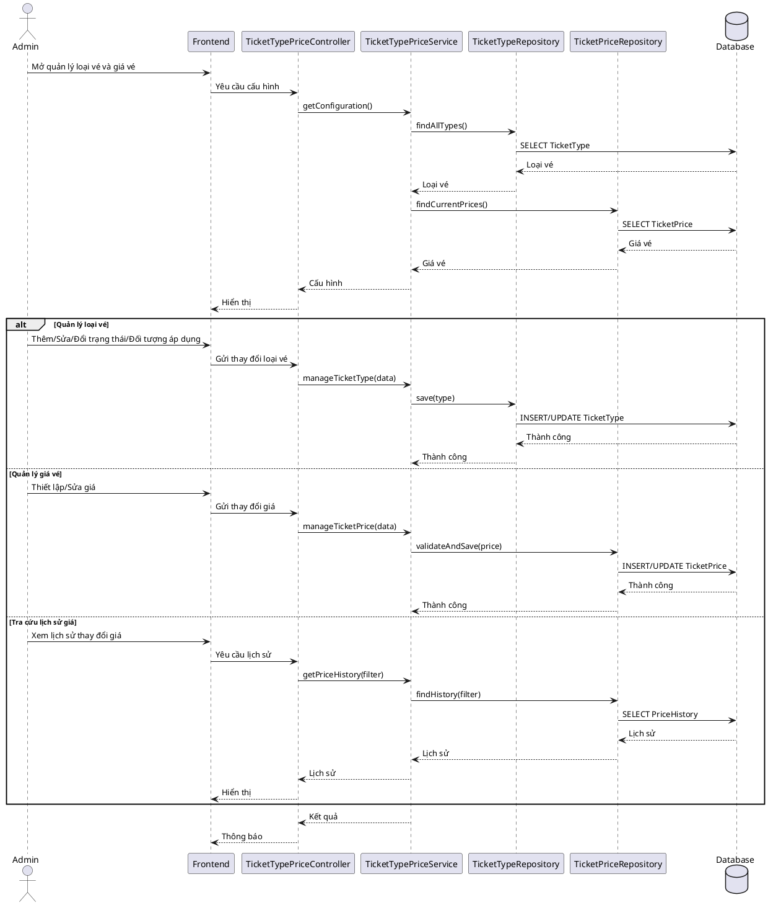
```plantuml
@startuml
actor Admin
participant Frontend
participant "TicketTypePriceController" as Controller
participant "TicketTypePriceService" as Service
participant "TicketTypeRepository" as TypeRepo
participant "TicketPriceRepository" as PriceRepo
database Database as DB

Admin -> Frontend : Mở quản lý loại vé và giá vé
Frontend -> Controller : Yêu cầu cấu hình
Controller -> Service : getConfiguration()
Service -> TypeRepo : findAllTypes()
TypeRepo -> DB : SELECT TicketType
DB --> TypeRepo : Loại vé
TypeRepo --> Service : Loại vé
Service -> PriceRepo : findCurrentPrices()
PriceRepo -> DB : SELECT TicketPrice
DB --> PriceRepo : Giá vé
PriceRepo --> Service : Giá vé
Service --> Controller : Cấu hình
Controller --> Frontend : Hiển thị

alt Quản lý loại vé
    Admin -> Frontend : Thêm/Sửa/Đổi trạng thái/Đối tượng áp dụng
    Frontend -> Controller : Gửi thay đổi loại vé
    Controller -> Service : manageTicketType(data)
    Service -> TypeRepo : save(type)
    TypeRepo -> DB : INSERT/UPDATE TicketType
    DB --> TypeRepo : Thành công
    TypeRepo --> Service : Thành công
else Quản lý giá vé
    Admin -> Frontend : Thiết lập/Sửa giá
    Frontend -> Controller : Gửi thay đổi giá
    Controller -> Service : manageTicketPrice(data)
    Service -> PriceRepo : validateAndSave(price)
    PriceRepo -> DB : INSERT/UPDATE TicketPrice
    DB --> PriceRepo : Thành công
    PriceRepo --> Service : Thành công
else Tra cứu lịch sử giá
    Admin -> Frontend : Xem lịch sử thay đổi giá
    Frontend -> Controller : Yêu cầu lịch sử
    Controller -> Service : getPriceHistory(filter)
    Service -> PriceRepo : findHistory(filter)
    PriceRepo -> DB : SELECT PriceHistory
    DB --> PriceRepo : Lịch sử
    PriceRepo --> Service : Lịch sử
    Service --> Controller : Lịch sử
    Controller --> Frontend : Hiển thị
end

Service --> Controller : Kết quả
Controller --> Frontend : Thông báo
@enduml
```

### Giải thích từng bước

1. Admin xem loại vé và giá vé hiện tại.
2. Admin chọn quản lý loại vé, quản lý giá hoặc tra cứu lịch sử giá.
3. Service kiểm tra cấu hình trước khi lưu.
4. Repository cập nhật Database và ghi nhận lịch sử thay đổi giá khi có thay đổi.
5. Thay đổi giá không ảnh hưởng Booking đã tạo.

---

## ADM-05 — Quản lý thực phẩm

### Flow

`Xem món + tồn kho → Thêm/Sửa/Đổi trạng thái/Theo dõi tồn kho → Kiểm tra → Lưu`

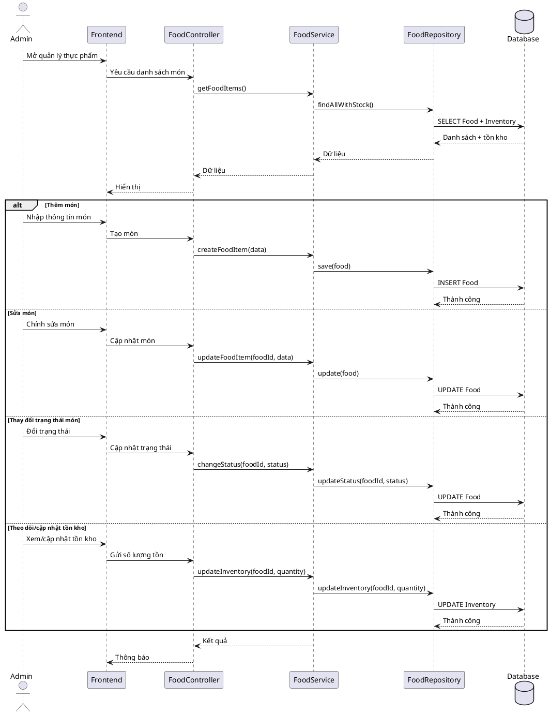
```plantuml
@startuml
actor Admin
participant Frontend
participant "FoodController" as Controller
participant "FoodService" as Service
participant "FoodRepository" as Repo
database Database as DB

Admin -> Frontend : Mở quản lý thực phẩm
Frontend -> Controller : Yêu cầu danh sách món
Controller -> Service : getFoodItems()
Service -> Repo : findAllWithStock()
Repo -> DB : SELECT Food + Inventory
DB --> Repo : Danh sách + tồn kho
Repo --> Service : Dữ liệu
Service --> Controller : Dữ liệu
Controller --> Frontend : Hiển thị

alt Thêm món
    Admin -> Frontend : Nhập thông tin món
    Frontend -> Controller : Tạo món
    Controller -> Service : createFoodItem(data)
    Service -> Repo : save(food)
    Repo -> DB : INSERT Food
    DB --> Repo : Thành công
else Sửa món
    Admin -> Frontend : Chỉnh sửa món
    Frontend -> Controller : Cập nhật món
    Controller -> Service : updateFoodItem(foodId, data)
    Service -> Repo : update(food)
    Repo -> DB : UPDATE Food
    DB --> Repo : Thành công
else Thay đổi trạng thái món
    Admin -> Frontend : Đổi trạng thái
    Frontend -> Controller : Cập nhật trạng thái
    Controller -> Service : changeStatus(foodId, status)
    Service -> Repo : updateStatus(foodId, status)
    Repo -> DB : UPDATE Food
    DB --> Repo : Thành công
else Theo dõi/cập nhật tồn kho
    Admin -> Frontend : Xem/cập nhật tồn kho
    Frontend -> Controller : Gửi số lượng tồn
    Controller -> Service : updateInventory(foodId, quantity)
    Service -> Repo : updateInventory(foodId, quantity)
    Repo -> DB : UPDATE Inventory
    DB --> Repo : Thành công
end

Service --> Controller : Kết quả
Controller --> Frontend : Thông báo
@enduml
```

### Giải thích từng bước

1. Admin xem danh sách món cùng tồn kho.
2. Admin thêm, sửa, đổi trạng thái hoặc theo dõi/cập nhật tồn kho.
3. Service kiểm tra dữ liệu và lưu qua Repository.
4. Khi tồn kho bằng 0, hệ thống đánh dấu hết hàng và không cho Customer chọn món trong Booking mới.

---

## ADM-06 — Quản lý đơn hàng

### Flow

`Xem toàn bộ Booking → Tìm kiếm/lọc → Chọn Booking → Xem chi tiết + tình trạng thanh toán`

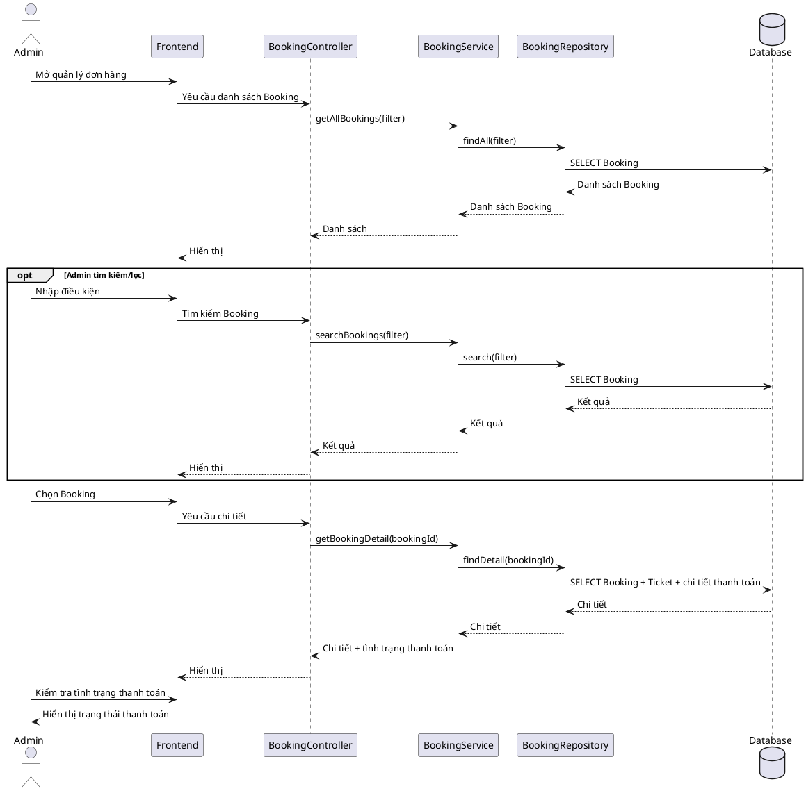
```plantuml
@startuml
actor Admin
participant Frontend
participant "BookingController" as Controller
participant "BookingService" as Service
participant "BookingRepository" as Repo
database Database as DB

Admin -> Frontend : Mở quản lý đơn hàng
Frontend -> Controller : Yêu cầu danh sách Booking
Controller -> Service : getAllBookings(filter)
Service -> Repo : findAll(filter)
Repo -> DB : SELECT Booking
DB --> Repo : Danh sách Booking
Repo --> Service : Danh sách Booking
Service --> Controller : Danh sách
Controller --> Frontend : Hiển thị

opt Admin tìm kiếm/lọc
    Admin -> Frontend : Nhập điều kiện
    Frontend -> Controller : Tìm kiếm Booking
    Controller -> Service : searchBookings(filter)
    Service -> Repo : search(filter)
    Repo -> DB : SELECT Booking
    DB --> Repo : Kết quả
    Repo --> Service : Kết quả
    Service --> Controller : Kết quả
    Controller --> Frontend : Hiển thị
end

Admin -> Frontend : Chọn Booking
Frontend -> Controller : Yêu cầu chi tiết
Controller -> Service : getBookingDetail(bookingId)
Service -> Repo : findDetail(bookingId)
Repo -> DB : SELECT Booking + Ticket + chi tiết thanh toán
DB --> Repo : Chi tiết
Repo --> Service : Chi tiết
Service --> Controller : Chi tiết + tình trạng thanh toán
Controller --> Frontend : Hiển thị

Admin -> Frontend : Kiểm tra tình trạng thanh toán
Frontend --> Admin : Hiển thị trạng thái thanh toán
@enduml
```

### Giải thích từng bước

1. Admin mở danh sách toàn bộ Booking.
2. Admin có thể tìm kiếm/lọc theo trạng thái, khách hàng, phim/suất chiếu, ngày đặt hoặc `ticketCode`.
3. Khi chọn Booking, hệ thống lấy chi tiết Booking, Ticket và tình trạng thanh toán.
4. Admin chỉ xem/tra cứu, không chỉnh sửa dữ liệu nghiệp vụ.

---

## ADM-07 — Quản lý tài khoản

### Flow

`Xem danh sách → Tìm kiếm/lọc → Chọn tài khoản → Thêm/Xem/Sửa/Khóa-Mở/Khởi tạo mật khẩu/Chức vụ → Kiểm tra quyền → Lưu`

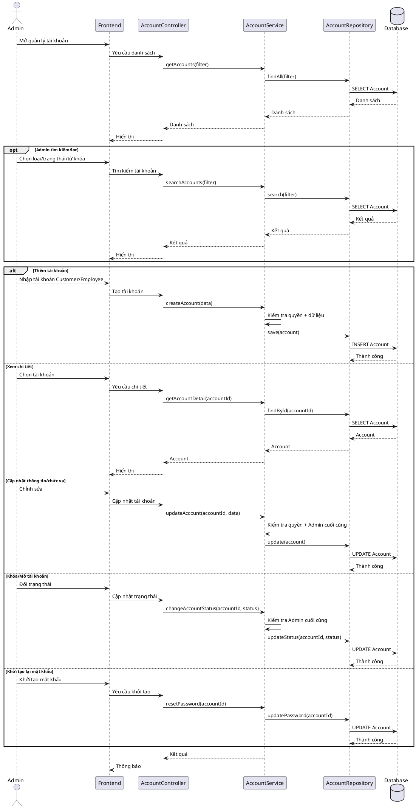
```plantuml
@startuml
actor Admin
participant Frontend
participant "AccountController" as Controller
participant "AccountService" as Service
participant "AccountRepository" as Repo
database Database as DB

Admin -> Frontend : Mở quản lý tài khoản
Frontend -> Controller : Yêu cầu danh sách
Controller -> Service : getAccounts(filter)
Service -> Repo : findAll(filter)
Repo -> DB : SELECT Account
DB --> Repo : Danh sách
Repo --> Service : Danh sách
Service --> Controller : Danh sách
Controller --> Frontend : Hiển thị

opt Admin tìm kiếm/lọc
    Admin -> Frontend : Chọn loại/trạng thái/từ khóa
    Frontend -> Controller : Tìm kiếm tài khoản
    Controller -> Service : searchAccounts(filter)
    Service -> Repo : search(filter)
    Repo -> DB : SELECT Account
    DB --> Repo : Kết quả
    Repo --> Service : Kết quả
    Service --> Controller : Kết quả
    Controller --> Frontend : Hiển thị
end

alt Thêm tài khoản
    Admin -> Frontend : Nhập tài khoản Customer/Employee
    Frontend -> Controller : Tạo tài khoản
    Controller -> Service : createAccount(data)
    Service -> Service : Kiểm tra quyền + dữ liệu
    Service -> Repo : save(account)
    Repo -> DB : INSERT Account
    DB --> Repo : Thành công
else Xem chi tiết
    Admin -> Frontend : Chọn tài khoản
    Frontend -> Controller : Yêu cầu chi tiết
    Controller -> Service : getAccountDetail(accountId)
    Service -> Repo : findById(accountId)
    Repo -> DB : SELECT Account
    DB --> Repo : Account
    Repo --> Service : Account
    Service --> Controller : Account
    Controller --> Frontend : Hiển thị
else Cập nhật thông tin/chức vụ
    Admin -> Frontend : Chỉnh sửa
    Frontend -> Controller : Cập nhật tài khoản
    Controller -> Service : updateAccount(accountId, data)
    Service -> Service : Kiểm tra quyền + Admin cuối cùng
    Service -> Repo : update(account)
    Repo -> DB : UPDATE Account
    DB --> Repo : Thành công
else Khóa/Mở tài khoản
    Admin -> Frontend : Đổi trạng thái
    Frontend -> Controller : Cập nhật trạng thái
    Controller -> Service : changeAccountStatus(accountId, status)
    Service -> Service : Kiểm tra Admin cuối cùng
    Service -> Repo : updateStatus(accountId, status)
    Repo -> DB : UPDATE Account
    DB --> Repo : Thành công
else Khởi tạo lại mật khẩu
    Admin -> Frontend : Khởi tạo mật khẩu
    Frontend -> Controller : Yêu cầu khởi tạo
    Controller -> Service : resetPassword(accountId)
    Service -> Repo : updatePassword(accountId)
    Repo -> DB : UPDATE Account
    DB --> Repo : Thành công
end

Service --> Controller : Kết quả
Controller --> Frontend : Thông báo
@enduml
```

### Giải thích từng bước

1. Admin xem và tìm kiếm tài khoản Customer/Employee.
2. Admin có thể thêm, xem chi tiết, chỉnh sửa, khóa/mở, khởi tạo mật khẩu hoặc chỉnh sửa chức vụ.
3. Service kiểm tra quyền và các ràng buộc, đặc biệt không được làm mất Admin cuối cùng.
4. Repository lưu thay đổi vào Database.
5. Tài khoản bị khóa/vô hiệu hóa sẽ không đăng nhập được.

---

## ADM-08 — Quản lý báo cáo và thống kê

### Flow

`Chọn loại báo cáo → Chọn kỳ + bộ lọc → Kiểm tra → Truy vấn Booking → Tổng hợp → Hiển thị → Xem chi tiết/xuất nếu được hỗ trợ`

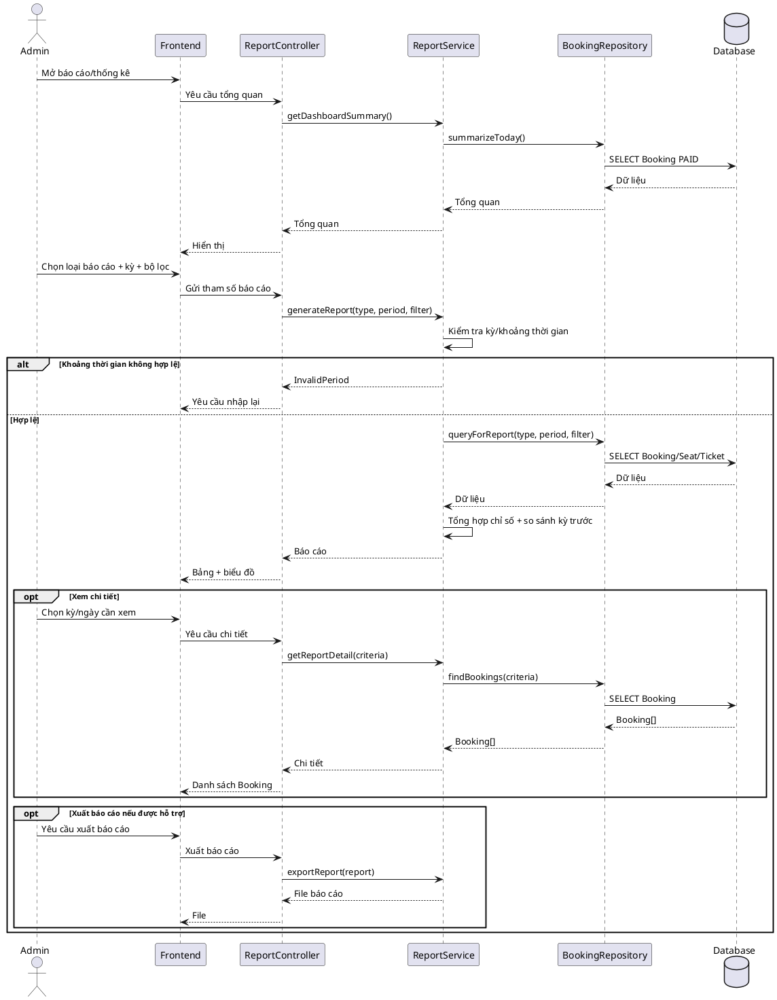
```plantuml
@startuml
actor Admin
participant Frontend
participant "ReportController" as Controller
participant "ReportService" as Service
participant "BookingRepository" as BookingRepo
database Database as DB

Admin -> Frontend : Mở báo cáo/thống kê
Frontend -> Controller : Yêu cầu tổng quan
Controller -> Service : getDashboardSummary()
Service -> BookingRepo : summarizeToday()
BookingRepo -> DB : SELECT Booking PAID
DB --> BookingRepo : Dữ liệu
BookingRepo --> Service : Tổng quan
Service --> Controller : Tổng quan
Controller --> Frontend : Hiển thị

Admin -> Frontend : Chọn loại báo cáo + kỳ + bộ lọc
Frontend -> Controller : Gửi tham số báo cáo
Controller -> Service : generateReport(type, period, filter)
Service -> Service : Kiểm tra kỳ/khoảng thời gian

alt Khoảng thời gian không hợp lệ
    Service --> Controller : InvalidPeriod
    Controller --> Frontend : Yêu cầu nhập lại
else Hợp lệ
    Service -> BookingRepo : queryForReport(type, period, filter)
    BookingRepo -> DB : SELECT Booking/Seat/Ticket
    DB --> BookingRepo : Dữ liệu
    BookingRepo --> Service : Dữ liệu
    Service -> Service : Tổng hợp chỉ số + so sánh kỳ trước
    Service --> Controller : Báo cáo
    Controller --> Frontend : Bảng + biểu đồ

    opt Xem chi tiết
        Admin -> Frontend : Chọn kỳ/ngày cần xem
        Frontend -> Controller : Yêu cầu chi tiết
        Controller -> Service : getReportDetail(criteria)
        Service -> BookingRepo : findBookings(criteria)
        BookingRepo -> DB : SELECT Booking
        DB --> BookingRepo : Booking[]
        BookingRepo --> Service : Booking[]
        Service --> Controller : Chi tiết
        Controller --> Frontend : Danh sách Booking
    end

    opt Xuất báo cáo nếu được hỗ trợ
        Admin -> Frontend : Yêu cầu xuất báo cáo
        Frontend -> Controller : Xuất báo cáo
        Controller -> Service : exportReport(report)
        Service --> Controller : File báo cáo
        Controller --> Frontend : File
    end
end
@enduml
```

### Giải thích từng bước

1. Admin mở chức năng báo cáo và nhận tổng quan nhanh.
2. Admin chọn báo cáo doanh thu hoặc báo cáo mức độ quan tâm theo phim.
3. Admin chọn ngày/tuần/tháng hoặc khoảng thời gian tùy chọn và bộ lọc.
4. Report Service kiểm tra kỳ thống kê rồi lấy dữ liệu Booking.
5. Service tổng hợp chỉ số và hiển thị bảng/biểu đồ, có thể so sánh với kỳ trước.
6. Admin có thể đi vào Booking chi tiết hoặc xuất báo cáo nếu chức năng được hỗ trợ.

---

## ADM-09 — Cài đặt hệ thống

### Flow

`Mở cài đặt → Lấy thông số → Chỉnh sửa hoặc sao lưu → Kiểm tra/thực hiện → Thông báo`

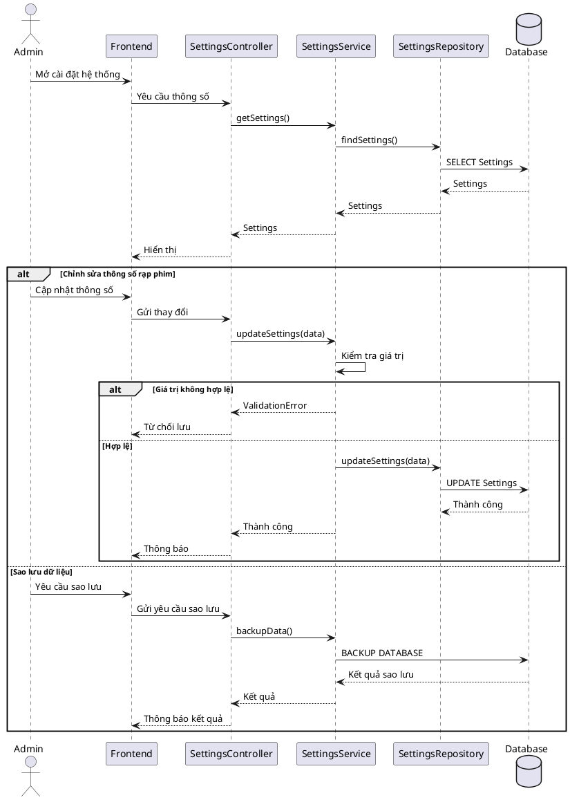
```plantuml
@startuml
actor Admin
participant Frontend
participant "SettingsController" as Controller
participant "SettingsService" as Service
participant "SettingsRepository" as Repo
database Database as DB

Admin -> Frontend : Mở cài đặt hệ thống
Frontend -> Controller : Yêu cầu thông số
Controller -> Service : getSettings()
Service -> Repo : findSettings()
Repo -> DB : SELECT Settings
DB --> Repo : Settings
Repo --> Service : Settings
Service --> Controller : Settings
Controller --> Frontend : Hiển thị

alt Chỉnh sửa thông số rạp phim
    Admin -> Frontend : Cập nhật thông số
    Frontend -> Controller : Gửi thay đổi
    Controller -> Service : updateSettings(data)
    Service -> Service : Kiểm tra giá trị
    alt Giá trị không hợp lệ
        Service --> Controller : ValidationError
        Controller --> Frontend : Từ chối lưu
    else Hợp lệ
        Service -> Repo : updateSettings(data)
        Repo -> DB : UPDATE Settings
        DB --> Repo : Thành công
        Service --> Controller : Thành công
        Controller --> Frontend : Thông báo
    end
else Sao lưu dữ liệu
    Admin -> Frontend : Yêu cầu sao lưu
    Frontend -> Controller : Gửi yêu cầu sao lưu
    Controller -> Service : backupData()
    Service -> DB : BACKUP DATABASE
    DB --> Service : Kết quả sao lưu
    Service --> Controller : Kết quả
    Controller --> Frontend : Thông báo kết quả
end
@enduml
```

### Giải thích từng bước

1. Admin mở cài đặt và xem thông số hiện tại.
2. Admin chọn chỉnh sửa thông số hoặc sao lưu dữ liệu.
3. Với chỉnh sửa, Service kiểm tra giá trị trước khi Repository lưu.
4. Với sao lưu, hệ thống thực hiện tác vụ sao lưu và trả kết quả.
5. Frontend thông báo thành công hoặc thất bại.

---

# 4. Quy trình nghiệp vụ quan trọng

## 4.1. Đặt vé online

```text
Customer
   ↓
CUS-04: Xem phim và suất chiếu
   ↓
CUS-05: Đặt vé online
   ↓
Chọn ghế AVAILABLE
   ↓
ShowtimeSeat: AVAILABLE → HOLD (5 phút)
   ↓
Booking: PENDING
   ↓
Thanh toán trực tuyến
   ├── Thất bại/hủy → Booking: CANCELLED
   ├── Hết 5 phút → Booking: EXPIRED + HOLD → AVAILABLE
   └── Thành công
          ↓
      Booking: PAID
          ↓
      ShowtimeSeat: HOLD → SOLD
          ↓
      Tạo Ticket + ticketCode
          ↓
      CUS-06: Xem vé điện tử/lịch sử
```

## 4.2. Vé điện tử

- Ticket chỉ được tạo sau khi Booking chuyển `PAID`.
- Mỗi Ticket có `ticketCode` duy nhất.
- Ticket không có `VALID/USED/CANCELLED`.
- Không dùng QR.
- Customer xem Ticket và `ticketCode` trong `CUS-06`.
- Admin tra cứu Ticket/`ticketCode` thông qua `ADM-06`.

## 4.3. Hold hết hạn

```text
BackgroundJob
    ↓
Tìm ShowtimeSeat = HOLD và hết hạn
    ↓
ShowtimeSeat → AVAILABLE
    ↓
Booking PENDING tương ứng → EXPIRED
```

Đây là xử lý nội bộ của hệ thống, **không phải Actor và không phải Use Case**.

---

# 5. Trạng thái nghiệp vụ liên quan

## 5.1. ShowtimeSeat

```text
AVAILABLE
    |
    | hold()
    v
  HOLD
  /    \
 /      \
|        | paymentSuccess()
|        v
|       SOLD
|
| timeout
v
AVAILABLE
```

- `AVAILABLE → HOLD`: Customer chọn ghế và hệ thống giữ ghế.
- `HOLD → SOLD`: thanh toán thành công.
- `HOLD → AVAILABLE`: hết thời gian Hold mà chưa thanh toán.
- Không xử lý `SOLD → AVAILABLE` trong baseline hiện tại.

## 5.2. Booking

```text
PENDING ── paymentSuccess() ──► PAID
   |
   ├── timeout ──► EXPIRED
   └── paymentFailed/cancel ──► CANCELLED
```

- `PENDING`: đã giữ ghế, chờ thanh toán.
- `PAID`: thanh toán thành công; tạo Ticket và `ticketCode`.
- `EXPIRED`: Hold hết hạn trước khi thanh toán thành công.
- `CANCELLED`: thanh toán thất bại/bị hủy theo luồng UC.

## 5.3. Ticket

```text
Ticket
  └── ticketCode (unique)
```

Ticket **không có trạng thái**.

---

# 6. Danh sách Use Case trong Sequence Diagram

## Customer

| ID | Use Case |
|---|---|
| CUS-01 | Đăng ký tài khoản |
| CUS-02 | Đăng nhập |
| CUS-03 | Quản lý thông tin cá nhân |
| CUS-04 | Xem phim và suất chiếu |
| CUS-05 | Đặt vé online |
| CUS-06 | Quản lý vé điện tử và lịch sử đặt vé |

## Admin

| ID | Use Case |
|---|---|
| ADM-01 | Quản lý phim |
| ADM-02 | Quản lý suất chiếu |
| ADM-03 | Quản lý phòng chiếu và sơ đồ chỗ ngồi |
| ADM-04 | Quản lý loại vé và giá vé |
| ADM-05 | Quản lý thực phẩm |
| ADM-06 | Quản lý đơn hàng |
| ADM-07 | Quản lý tài khoản |
| ADM-08 | Quản lý báo cáo và thống kê |
| ADM-09 | Cài đặt hệ thống |

**Tổng: 15 Use Case — 02 Actor.**

---